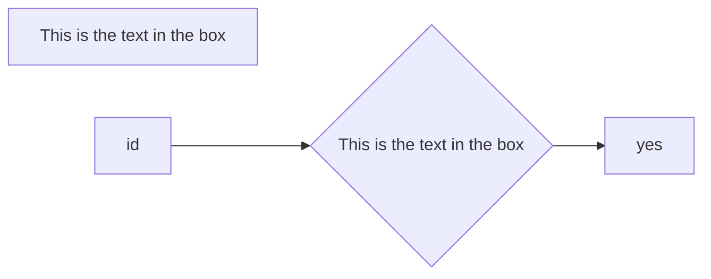

# 內容

一些素材來源待補

## 聲音API

[DEMO](http://lauraluo.github.io/webGL-demo/audio.html)

## 圖片轉粒子

[DEMO](http://lauraluo.github.io/webGL-demo/particle.html)

## 3D物件導入

[DEMO](http://lauraluo.github.io/webGL-demo/import)

## MMD導入

## 360影片forIE11-使用valiant.jquery

